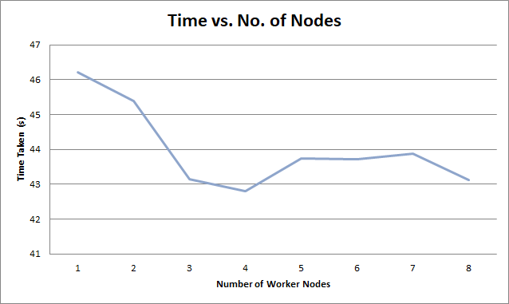

# Cyclomatic Complexity
- **Paul Shanahan** - MAI Computer Engineering

The cyclomatic complexity analyser is built in Haskell using the Argon library. This project computes the cyclomatic complexity of a GitHub repository.


The server meets all requirements outlined at:
-[Specification](https://www.scss.tcd.ie/Stephen.Barrett/teaching/CS4400/index.html) - TCD Credentials Required


### System Requirements
```
Argon

Please Argon is installed and available in the terminal using 'argon'.
- https://github.com/rubik/argon

```

### Running the Analyser

1. Clone and 'stack build' this repo.
2. Start the X (X < 9) number of worker nodes: `bash workers/X.sh`
3. Run analysis: `bash start.sh <URL of repo to analyse>`


### Results
The output of each analysis is a time taken to compute the cyclomatic complexity. By running the analysis over a number of iterations,
while increasing the number of workers each time, we can plot the relationship between the number of nodes and time taken.
```
Note! that the data below is from an AMD V120 Single Core Processor calculating the complexity of this repository.
Although there was a decrease in time with more than one node, the existence of only one core meant that introducing more nodes did not have a huge impact on time taken as the nodes
were limited to one core. If more cores were available, the time would decrease to a great extent as number of nodes increases.
Theoretically, the rate of decrease as nodes are added would initially be high, with the rate slowing as lots of nodes are added.
```




| No. of Workers | Time (s) |
| ------------- | --------- |
| 1 | 46.209041 |
| 2 | 45.379339 |
| 3 | 43.150945 |
| 4 | 42.811508 |
| 5 | 43.738079 |
| 6 | 43.723881 |
| 7 | 43.884991 |
| 8 | 43.118618 |

